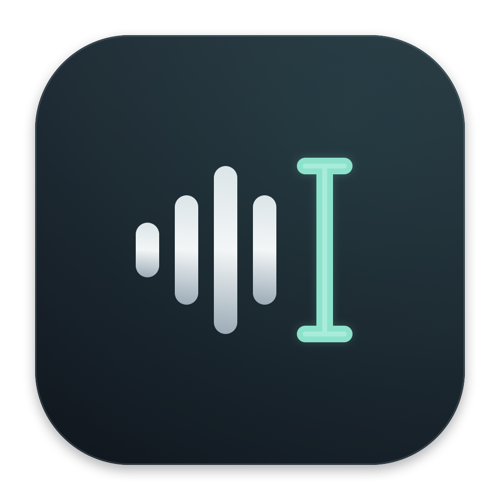

# Voxa — macOS / Windows 语音输入

[中文](README.md) | [English](README.en.md)



**让语音直接变成光标处的文字。** Voxa 在菜单栏或系统托盘运行，通过全局快捷键开始听写，显示实时预览，并在完成后向当前输入框输入文字。

## 下载与安装

[下载 v1.3.0 安装包](https://github.com/SergioTermann/Voxa/releases/tag/v1.3.0) · [查看所有版本](https://github.com/SergioTermann/Voxa/releases)

| 平台 | 下载文件 | 安装方式 | 系统要求 |
| --- | --- | --- | --- |
| macOS | [`Voxa-v1.3.0-macOS-arm64.dmg`](https://github.com/SergioTermann/Voxa/releases/download/v1.3.0/Voxa-v1.3.0-macOS-arm64.dmg) | 打开 DMG，把 **Voxa.app** 拖到 **Applications（应用程序）** | Apple Silicon，macOS 13+ |
| macOS（ZIP） | [`Voxa-v1.3.0-macOS-arm64.zip`](https://github.com/SergioTermann/Voxa/releases/download/v1.3.0/Voxa-v1.3.0-macOS-arm64.zip) | 解压后把 **Voxa.app** 移到“应用程序” | 同上 |
| Windows | [`Voxa-v1.3.0-Windows-Setup-x64.exe`](https://github.com/SergioTermann/Voxa/releases/download/v1.3.0/Voxa-v1.3.0-Windows-Setup-x64.exe) | 双击安装，支持中文 / 英文安装向导、快捷方式和卸载 | Windows 10 / 11，x64，兼容的本机 SAPI 听写引擎 |
| Windows（便携版） | [`Voxa-v1.3.0-Windows-x64.zip`](https://github.com/SergioTermann/Voxa/releases/download/v1.3.0/Voxa-v1.3.0-Windows-x64.zip) | 完整解压后运行 **Voxa.exe** | 同上 |

Windows 安装包包含 .NET 运行时，无需另装 .NET，也无需管理员权限。安装到 `%LOCALAPPDATA%\Programs\Voxa`，可从 Windows“已安装的应用”卸载；更新或卸载前请通过托盘退出 Voxa。

macOS 安装包目前未经过 Apple 公证，Windows 安装包目前没有代码签名。macOS 首次打开可能需要在“系统设置 → 隐私与安全性”允许打开；Windows 可能显示未知发布者提示。请从本仓库的 Release 下载。安装包不是 Mac App Store 分发包。

## macOS 快速开始

1. 从“应用程序”启动 Voxa。
2. 开启 **Microphone（麦克风）**、**Speech Recognition（语音识别）** 和 **Accessibility（辅助功能）** 权限。辅助功能需在“系统设置 → 隐私与安全性 → 辅助功能”启用 Voxa。
3. 在“系统设置 → 键盘 → 听写”开启 macOS 听写。
4. 点击浏览器、聊天软件、文档或编辑器中的可编辑输入框。
5. **快速按下并松开右 Command 两次**，开始说话。每次按住不超过 0.5 秒，两次之间间隔不超过 0.65 秒。
6. 停顿后自动完成并输入；也可再次使用快捷键，或点击浮窗 **Finish & Insert**。

**Control + Option + Space** 是右 Command 双击 / 三连空格模式下的备用快捷键；**Control + Option + Esc** 取消。菜单栏提供开始、完成、设置、复制和退出。

### macOS 设置

- **Start / Finish Shortcut**：右 Command 双击、Control + Option + V、Command + Shift + Space、Control + Option + Space 或三连空格。若组合被占用，保留原设置。
- **Dictation Language**：美国英语、简体中文普通话、香港粤语、繁体中文普通话。新安装默认英语。
- **Offline only**：禁止在本机识别不可用时使用 Apple 在线识别。
- **Automatically insert after a pause**：默认开启；识别文字稳定且麦克风安静约 1.6 秒后完成。

右 Command 监听不拦截按键或延迟普通输入。长按、使用 Command 组合键、鼠标点击或切换应用会中断双击序列。只有三连空格会暂存并拦截空格：连续按键间隔不超过 0.32 秒，普通空格最多延迟约 0.32 秒，三个触发空格被消耗。必要时启用“输入监控”权限并重启。

macOS 应用界面为英文；文档提供中英文，识别语言可以独立选择。

## Windows 快速开始

1. 启动 Voxa，选择下拉框中实际安装的本机识别语言。
2. 在 Windows 麦克风隐私设置中允许桌面应用访问麦克风，并确认默认录音设备可用。
3. 点击记事本或其他应用中的可编辑输入框。
4. **快速按下并松开右 Ctrl 两次**开始，浮窗显示实时文字。
5. 停顿后自动完成，或再次**双击右 Ctrl**完成并输入。
6. 按 **Ctrl + Alt + Esc** 取消。关闭设置窗口后继续在系统托盘运行；从托盘退出程序。

Windows 版采用深色卡片界面、独立转写区域和显示麦克风音量的听写浮窗。界面为中文，安装向导提供中文 / 英文。**Ctrl + Alt + Space** 保留为备用快捷键。右 Ctrl 每次按住不超过 0.5 秒，两次间隔不超过 0.65 秒；长按、组合键、鼠标操作和切换窗口会中断序列，普通按键不会被拦截。

语言组件必须提供 `System.Speech` 可访问的 **SAPI 听写引擎**；Win + H 或“语音访问”能用，并不代表该引擎已安装。没有兼容引擎时无法听写。Windows 11 24H2 移除了旧版语音识别界面，不能保证每台新系统都有兼容引擎。

详细兼容条件、开发和验收说明：[Windows 中文说明](windows/README.md) · [Windows English guide](windows/README.en.md)。Windows 版仍需在目标设备验证真实麦克风识别和各应用的输入兼容性。

## 识别与隐私

- 两个平台均无需 API Key。
- macOS 优先使用 Apple 本机识别；不可用时可能把音频发送到 Apple 在线语音服务。开启 **Offline only** 可禁止这一回退。
- Windows 使用所选本机 SAPI 引擎，没有实现云端 API 调用。
- 每次会话最长约 55 秒。较长内容请分段听写。
- Voxa 不保存录音或转写日志；最近结果只保存在内存，退出后清除。
- Windows 只把识别引擎 ID 和自动结束偏好写到 `%LOCALAPPDATA%\Voxa\settings.json`；macOS 使用系统偏好存储。
- 手动复制会把文字写入系统剪贴板，之后由系统剪贴板历史及同步设置管理。
- Windows 右 Ctrl 检测使用全局键盘与鼠标监听，只判断触发序列，不保存其他键盘输入。

## 输入行为

听写中可以切换输入框；**完成时**确定目标。如果完成过程中窗口或输入框焦点变化，结果保留供手动复制。选中的文字按目标应用的正常行为被替换。密码框及无法确认可编辑的控件不支持自动输入。

macOS 优先使用辅助功能直接写入；失败时通过系统粘贴回退，临时使用剪贴板并在约一秒后恢复。期间如果用户复制了新内容，不覆盖它。Windows 使用 Unicode 按键输入，不改动剪贴板，不发送 Enter 或 Tab；向管理员窗口输入可能被系统阻止。Windows 接受按键不代表目标应用必然显示文字，失败时请检查输入框再手动复制。

自定义编辑器、游戏、远程桌面或部分网页控件可能不兼容。macOS 不主动发送 Return，终端的粘贴行为由终端本身决定。

## 常见问题

- **macOS 提示 “Siri and Dictation are disabled”**：在系统键盘设置开启听写并接受系统提示；开关不可用时检查屏幕使用时间或设备管理限制。
- **Windows 识别语言列表为空**：尝试安装语言选项中的语音组件后重启；只有兼容 SAPI 引擎才能使用，现代听写语言包不一定兼容。
- **文字停留在预览**：检查自动完成设置，或再次按开始 / 完成快捷键。
- **文字未输入**：保持目标输入框焦点，检查权限与控件兼容性；最近结果可手动复制。
- **Windows 快捷键注册失败**：退出占用快捷键的程序后重启 Voxa。

## 从源码构建

### macOS

需要 Apple Silicon Mac、macOS 13+ 和 Xcode 命令行工具：

```sh
bash scripts/build.sh
bash scripts/test.sh
bash scripts/package-macos.sh
```

输出 `build/Voxa.app`、DMG 和 ZIP。构建优先使用本地 Apple Development 签名，否则使用临时签名；可通过 `VOICECURSOR_SIGN_IDENTITY` 指定证书。该流程不自动进行 Apple 公证。

### Windows

需要 [.NET 8 SDK](https://dotnet.microsoft.com/download/dotnet/8.0)；安装包编译还需要 [NSIS 3](https://nsis.sourceforge.io/Download)，并将 `makensis` 加到 PATH：

```powershell
./windows/build-installer.ps1
```

仅构建便携版可运行 `./windows/build.ps1`。跨平台打包命令见 Windows 说明。GitHub Actions 会构建安装包、执行基础检查；发布 `v*` 标签时，两平台产物自动上传到对应 Release。

## 验证范围

macOS 测试覆盖快捷键序列、普通空格重放、密码框策略、自动完成、剪贴板恢复和启动。Windows 核心测试覆盖实时片段与最终结果合并、中文间距、重复语句、自动结束、控制字符清理和原生输入结构。CI 检查 Windows 程序启动与静默安装 / 卸载；这些检查不能替代真实麦克风与跨应用输入验收。
